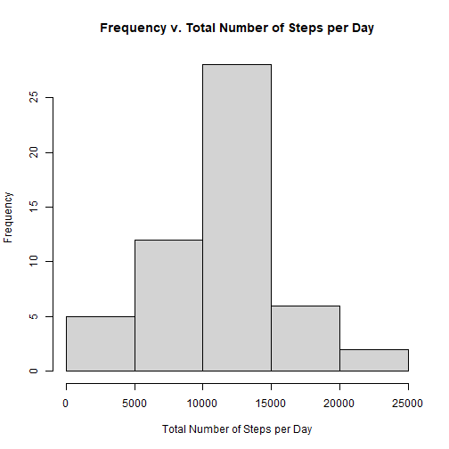
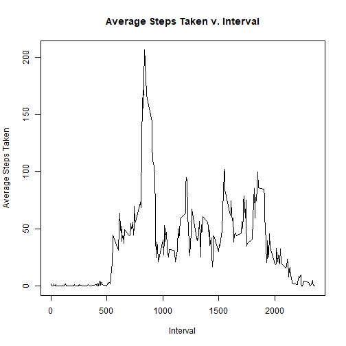
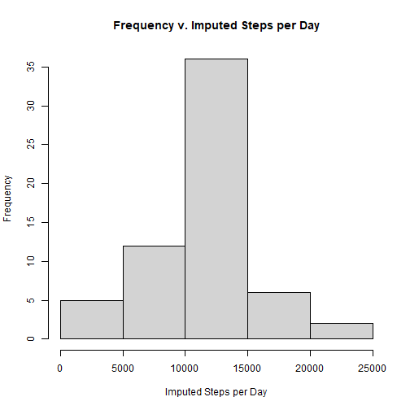
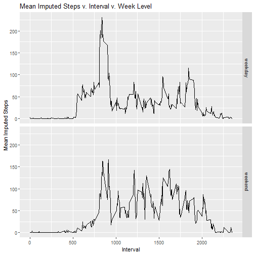

## Loading and preprocessing the data

1. Load the data (i.e. read.csv()).


``` r
table <- read.csv("activity.csv")
as_tibble(table)
```

```
## # A tibble: 17,568 × 3
##    steps date       interval
##    <int> <chr>         <int>
##  1    NA 2012-10-01        0
##  2    NA 2012-10-01        5
##  3    NA 2012-10-01       10
##  4    NA 2012-10-01       15
##  5    NA 2012-10-01       20
##  6    NA 2012-10-01       25
##  7    NA 2012-10-01       30
##  8    NA 2012-10-01       35
##  9    NA 2012-10-01       40
## 10    NA 2012-10-01       45
## # ℹ 17,558 more rows
```

2. Process/transform the data (if necessary) into a format suitable for your analysis.


``` r
print("The data is already suitable for our analysis.")
```

```
## [1] "The data is already suitable for our analysis."
```

## What is the mean total number of steps taken per day?

1. Calculate the total number of steps taken per day.


``` r
steps_per_day <- table %>%
        filter(!is.na(steps)) %>%
        group_by(date) %>%
        summarize(StepsPerDay = sum(steps)) %>%
        ungroup()
as_tibble(steps_per_day)
```

```
## # A tibble: 53 × 2
##    date       StepsPerDay
##    <chr>            <int>
##  1 2012-10-02         126
##  2 2012-10-03       11352
##  3 2012-10-04       12116
##  4 2012-10-05       13294
##  5 2012-10-06       15420
##  6 2012-10-07       11015
##  7 2012-10-09       12811
##  8 2012-10-10        9900
##  9 2012-10-11       10304
## 10 2012-10-12       17382
## # ℹ 43 more rows
```

2. If you do not understand the difference between a histogram and a barplot, research the difference between them. Make a histogram of the total number of steps taken each day.


``` r
hist(x = steps_per_day$StepsPerDay,
     main = "Frequency v. Total Number of Steps per Day",
     xlab = "Total Number of Steps per Day")
```



3. Calculate and report the mean and median of the total number of steps taken per day.


``` r
mean_steps_per_day <- mean(steps_per_day$StepsPerDay)
print(str_c("The mean of the total number of steps per day is ",
            mean_steps_per_day,
            "."))
```

```
## [1] "The mean of the total number of steps per day is 10766.1886792453."
```

``` r
median_steps_per_day <- median(steps_per_day$StepsPerDay)
print(str_c("The median of the total number of steps per day is ",
            median_steps_per_day,
            "."))
```

```
## [1] "The median of the total number of steps per day is 10765."
```

## What is the average daily activity pattern?

1. Make a time series plot (i.e. type = "l") of the 5-minute interval (x-axis) and the average number of steps taken, averaged across all days (y-axis).


``` r
mean_steps_per_interval <- table %>%
        filter(!is.na(steps)) %>%
        group_by(interval) %>%
        summarize(MeanStepsPerInterval = mean(steps)) %>%
        ungroup()
plot(x = mean_steps_per_interval$interval,
     y = mean_steps_per_interval$MeanStepsPerInterval,
     main = "Average Steps Taken v. Interval",
     xlab = "Interval",
     ylab = "Average Steps Taken",
     type = "l")
```



2. Which 5-minute interval, on average across all the days in the dataset, contains the maximum number of steps?


``` r
MaxMeanStepsPerInterval <- max(mean_steps_per_interval$MeanStepsPerInterval)
IntervalsWithMaxMean <- mean_steps_per_interval %>%
        filter(MeanStepsPerInterval == MaxMeanStepsPerInterval)
print(str_c("The interval with the maximum average steps is Interval ",
            IntervalsWithMaxMean$interval, 
            "."))
```

```
## [1] "The interval with the maximum average steps is Interval 835."
```

## Imputing missing values

## Note that there are a number of days/intervals where there are missing values (coded as NA). The presence of missing days may introduce bias into some calculations or summaries of the data.

1. Calculate and report the total number of missing values in the dataset (i.e. the total number of rows with NAs).


``` r
na_rows <- table %>%
        filter(is.na(steps) | is.na(date) | is.na(interval)) %>%
        nrow()
print(str_c("There are ",
            na_rows,
            " rows with NAs in this dataset."))
```

```
## [1] "There are 2304 rows with NAs in this dataset."
```

2. Devise a strategy for filling in all of the missing values in the dataset. The strategy does not need to be sophisticated. For example, you could use the mean/median for that day, or the mean for that 5-minute interval, etc.


``` r
print("We will replace every NA in the dataset with the mean number of steps for the interval listed in that row rounded to the nearest integer.")
```

```
## [1] "We will replace every NA in the dataset with the mean number of steps for the interval listed in that row rounded to the nearest integer."
```

3. Create a new dataset that is equal to the original dataset but with the missing data filled in.


``` r
imputed_data <- table %>%
        inner_join(mean_steps_per_interval, by = "interval") %>%
        mutate(steps = if_else(is.na(steps),
                               round(MeanStepsPerInterval,0),
                               steps)) %>%
        select(steps,
               date,
               interval)
as_tibble(imputed_data)
```

```
## # A tibble: 17,568 × 3
##    steps date       interval
##    <dbl> <chr>         <int>
##  1     2 2012-10-01        0
##  2     0 2012-10-01        5
##  3     0 2012-10-01       10
##  4     0 2012-10-01       15
##  5     0 2012-10-01       20
##  6     2 2012-10-01       25
##  7     1 2012-10-01       30
##  8     1 2012-10-01       35
##  9     0 2012-10-01       40
## 10     1 2012-10-01       45
## # ℹ 17,558 more rows
```

4. Make a histogram of the total number of steps taken each day and Calculate and report the mean and median total number of steps taken per day.  Do these values differ from the estimates from the first part of the assignment?  What is the impact of imputing missing data on the estimates of the total daily number of steps?


``` r
imputed_steps_per_day <- imputed_data %>%
        group_by(date) %>%
        summarize(ImputedStepsPerDay = sum(steps)) %>%
        ungroup()

hist(x = imputed_steps_per_day$ImputedStepsPerDay,
     main = "Frequency v. Imputed Steps per Day",
     xlab = "Imputed Steps per Day")
```



``` r
mean_imputed_steps_per_day <- mean(imputed_steps_per_day$ImputedStepsPerDay)
print(str_c("The mean of the imputed number of steps per day is ",
            mean_imputed_steps_per_day,
            "."))
```

```
## [1] "The mean of the imputed number of steps per day is 10765.6393442623."
```

``` r
print(str_c("The original mean of the total number of steps per day exceeds ",
            "the mean of the imputed number of steps per day by ",
            mean_steps_per_day - mean_imputed_steps_per_day,
            "."))
```

```
## [1] "The original mean of the total number of steps per day exceeds the mean of the imputed number of steps per day by 0.549334982986693."
```

``` r
median_imputed_steps_per_day <- median(imputed_steps_per_day$ImputedStepsPerDay)
print(str_c("The median of the imputed number of steps per day is ",
            median_imputed_steps_per_day,
            "."))
```

```
## [1] "The median of the imputed number of steps per day is 10762."
```

``` r
print(str_c("The original median of the total number of steps per day exceeds ",
            "the median of the imputed number of steps per day by ",
            median_steps_per_day - median_imputed_steps_per_day,
            "."))
```

```
## [1] "The original median of the total number of steps per day exceeds the median of the imputed number of steps per day by 3."
```

``` r
print(str_c("Therefore, the way by which we imputed missing data decreased ",
            "both the mean and the median number of steps per day."))
```

```
## [1] "Therefore, the way by which we imputed missing data decreased both the mean and the median number of steps per day."
```

## Are there differences in activity patterns between weekdays and weekends?

## For this part the weekdays() function may be of some help here. Use the dataset with the filled-in missing values for this part.

1. Create a new factor variable in the dataset with two levels – “weekday” and “weekend” indicating whether a given date is a weekday or weekend day.


``` r
imputed_week_levels <- imputed_data %>%
        mutate(weekday = weekdays(as.Date(date, format = "%Y-%m-%d"))) %>%
        mutate(week_level = if_else(weekday %in% c("Saturday",
                                                   "Sunday"),
                                    "weekend",
                                    "weekday")) %>%
        mutate(week_level = as.factor(week_level))
as_tibble(imputed_week_levels)
```

```
## # A tibble: 17,568 × 5
##    steps date       interval weekday week_level
##    <dbl> <chr>         <int> <chr>   <fct>     
##  1     2 2012-10-01        0 Monday  weekday   
##  2     0 2012-10-01        5 Monday  weekday   
##  3     0 2012-10-01       10 Monday  weekday   
##  4     0 2012-10-01       15 Monday  weekday   
##  5     0 2012-10-01       20 Monday  weekday   
##  6     2 2012-10-01       25 Monday  weekday   
##  7     1 2012-10-01       30 Monday  weekday   
##  8     1 2012-10-01       35 Monday  weekday   
##  9     0 2012-10-01       40 Monday  weekday   
## 10     1 2012-10-01       45 Monday  weekday   
## # ℹ 17,558 more rows
```

2. Make a panel plot containing a time series plot (i.e. type = "l") of the 5-minute interval (x-axis) and the average number of steps taken, averaged across all weekday days or weekend days (y-axis). See the README file in the GitHub repository to see an example of what this plot should look like using simulated data.


``` r
mean_imputed_steps_per_interval_per_level <- imputed_week_levels %>%
        group_by(interval,
                 week_level) %>%
        summarize(MeanImputedStepsPerIntervalPerLevel = mean(steps),
                  .groups = "keep") %>%
        ungroup()
ggplot(mean_imputed_steps_per_interval_per_level,
       aes(x = interval, 
           y = MeanImputedStepsPerIntervalPerLevel)) +
  geom_line() + #' This is equivalent to type "l" in the "plot" function.
  facet_grid(rows = vars(week_level)) +
  labs(title = "Mean Imputed Steps v. Interval v. Week Level",
       x = "Interval",
       y = "Mean Imputed Steps")
```


